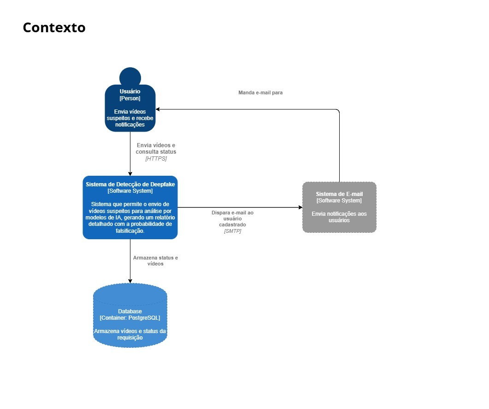
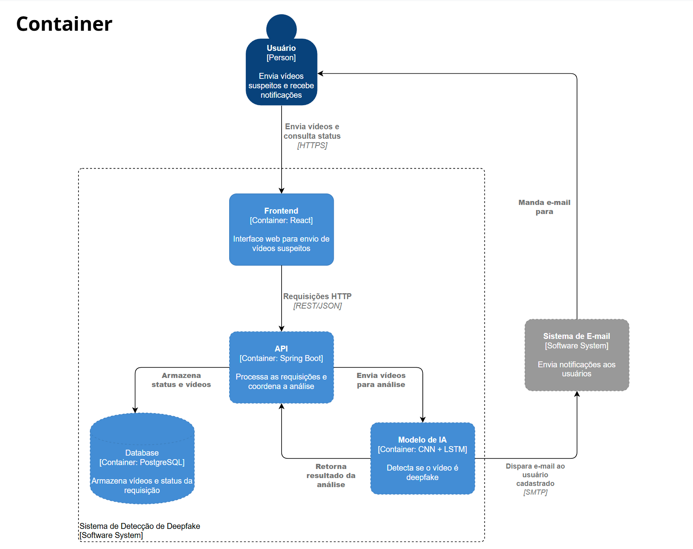
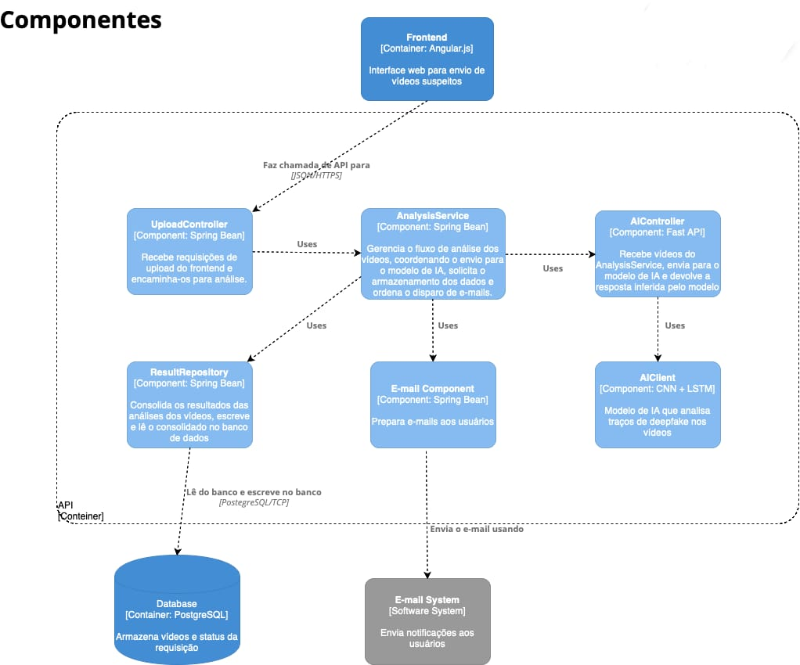

# Padrões de Arquitetura de Software - Verão

```bash
Integrantes:
João Gabriel Cavalcante França - 202201695
Joseppe Pedro Cunha Fellini - 202300194
Mikhael Machado Fernandes Maia - 202004771
Wendel Márcio de Oliveira Filho - 202105056
```

# Detecção de Vídeos Gerados por Modelos GAN
* Slides: https://docs.google.com/presentation/d/1DgzvqjwAH4gJurORHiInOSs1ZNeVvWo6Hj6tNCSmbZo/edit#slide=id.p
  
## C4 Model

### 1. Context

<p align="center">
    
<p>

### 2. Containers

<p align="center">
    
<p>

### 3. Components
<p align="center">
    
<p>

### 4. Code
