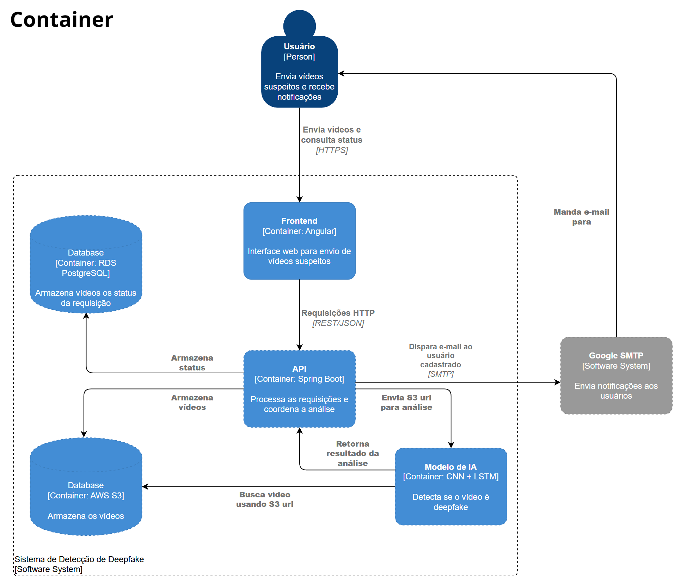

# Padrões de Arquitetura de Software - Verão

```bash
Integrantes:
João Gabriel Cavalcante França - 202201695
Joseppe Pedro Cunha Fellini - 202300194
Mikhael Machado Fernandes Maia - 202004771
Wendel Márcio de Oliveira Filho - 202105056
```

# Detecção de Vídeos Gerados por Modelos GAN

## C4 Model

### 1. Context

<p align="center">
    
<p>

### 2. Containers

<p align="center">
    
<p>

### 3. Components

### 4. Code
