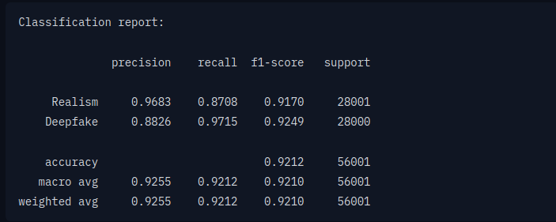
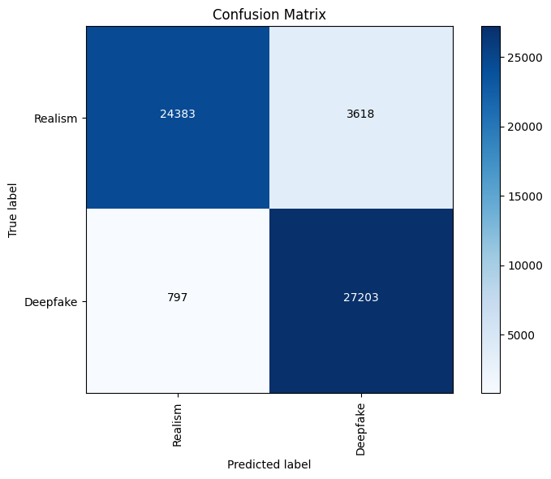

# Datasets utilizados
* [Kaggle Deepfake Detection Challenge](https://www.kaggle.com/competitions/deepfake-detection-challenge)
* [Hugging Face Deepfake Datasets](https://huggingface.co/datasets?modality=modality:image&sort=trending&search=deepfake)

# Arquitetura
#### O modelo é baseado em [Vision Transformer (ViT)](https://arxiv.org/abs/2010.11929), tratando a imagem como uma sequência indexada de patches e utiliza um transformer para aprender "padrões" entre as relações espaciais da imagem. Seus principais componentes:
* Patch Embedding: Divide a imagem em blocos de 16x16 pixels (patches).
* Transformer Encoder: Aprende os padrões entre os patches embeddings usando self-attention.
* Classification Head: Uma camada para classificação binária (real ou deepfake).

### Alguns hiper-parâmetros:
* Optimizer: AdamW com learning rate de 1e-6.
* Batch Size: 32 para training, 8 para evaluation.
* Epochs: 2.
* Data Augmentation:
* Random rotation (±90 degrees).
* Random sharpness adjustment.
* Random resizing and cropping.
* Loss Function: Cross-Entropy Loss.
* Evaluation Metrics: Accuracy, F1 Score, and Confusion Matrix.

## Métricas de Avaliação

    

## Matriz de Confusão

    

